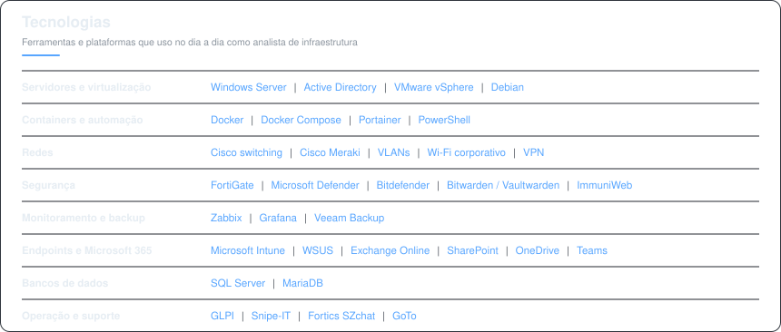

## Olá, eu sou o Raul 👋

**Analista de Infraestrutura de TI** · Jundiaí, SP 🇧🇷

Trabalho na sustentação e evolução do ambiente de infraestrutura, segurança e cloud da
operação brasileira de uma indústria multinacional, com escopo em redes, monitoramento,
continuidade de negócio, governança de endpoints e Microsoft 365.

Meu trabalho é menos sobre escrever código e mais sobre manter tudo de pé: padronizar
rotinas, eliminar configuração manual, garantir que o backup restaure quando alguém
precisar e que o problema apareça no dashboard antes de aparecer no chamado.

- 🏢 Analista de Infraestrutura na **Indorama Brasil** desde 2022
- 🎓 Graduado em **Engenharia da Computação** pela Anhanguera Educacional
- 🔍 Áreas de foco: **monitoramento**, **segurança de endpoints**, **continuidade de negócio** e **redes corporativas**
- 🌱 Estudando **automação de rotinas de infraestrutura com PowerShell**

  

---

### ⚡ Atividade recente

<!-- Não apague os marcadores: o GitHub Actions escreve entre eles. -->
<!--START_SECTION:activity-->
<!--END_SECTION:activity-->

<!--
  ESTATÍSTICAS: deixei comentado de propósito.
  Enquanto você não tiver repositórios e commits, o card mostra zeros
  e chama atenção para o que falta. Descomente depois de subir código.

  

-->

<!--
  OPCIONAL: se estiver aberto a propostas, descomente a linha abaixo.

-->

---

  

